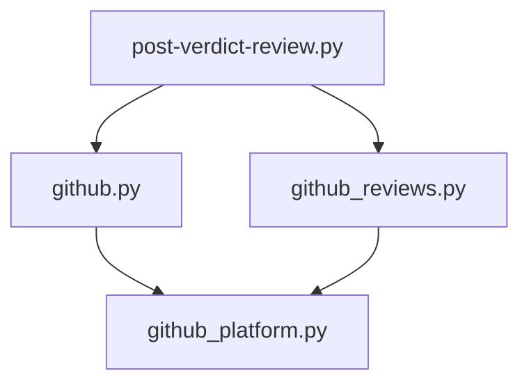
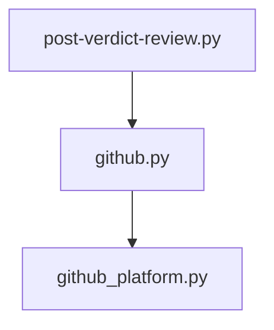

# Walkthrough: Collapse GitHub Review Helpers

## Title

Collapse the shallow `github_reviews.py` compatibility layer into `github.py` while preserving the `github_platform.py` adapter boundary.

## Why Now

Cerberus recently centralized GitHub transport in `scripts/lib/github_platform.py`, but one review-path layer was still split across `github.py` and `github_reviews.py`. That left reviewers and future maintainers with two compatibility modules to inspect for one behavior path, even though only `post-verdict-review.py` still consumed the review helper surface.

## Before

- `scripts/lib/github.py` owned PR comment upsert behavior and comment-oriented exception translation.
- `scripts/lib/github_reviews.py` re-exported PR review listing, PR file listing, review creation, and marker lookup with the same exception translation pattern.
- `scripts/post-verdict-review.py` had to import review-path helpers from two wrapper modules even though both delegated into `scripts/lib/github_platform.py`.



## What Changed

- Moved `ReviewComment`, `list_pr_reviews`, `find_review_id_by_marker`, `list_pr_files`, and `create_pr_review` into `scripts/lib/github.py`.
- Updated `scripts/post-verdict-review.py` to use one review-path helper module.
- Deleted `scripts/lib/github_reviews.py`.
- Updated the execution-boundary test and current-state docs so they describe the new seam instead of the removed wrapper.

## After

- `scripts/lib/github.py` is now the single caller-facing review-path helper module.
- `scripts/lib/github_platform.py` still owns all GitHub transport behavior.
- `scripts/post-verdict-review.py` no longer needs to understand an extra compatibility split to post inline verdict reviews.



## Evidence

### Focused regression slice

```text
$ python3 -m pytest tests/test_github.py tests/test_github_reviews.py tests/test_post_verdict_review.py tests/test_execution_boundary.py -q
79 passed in 0.26s
```

### Full repo gate

```text
$ make validate
1668 passed, 1 skipped in 58.24s
All checks passed!
✓ All validation checks passed
```

## Persistent Verification

- `make validate`

## Residual Risk

- Historical walkthrough notes still mention `github_reviews.py` because they document older branches. Current-state docs were updated, but those historical artifacts intentionally remain unchanged.

## Merge Case

This branch removes one whole compatibility module without changing runtime behavior, keeps the adapter boundary intact, and makes the verdict review path cheaper to understand and extend.
