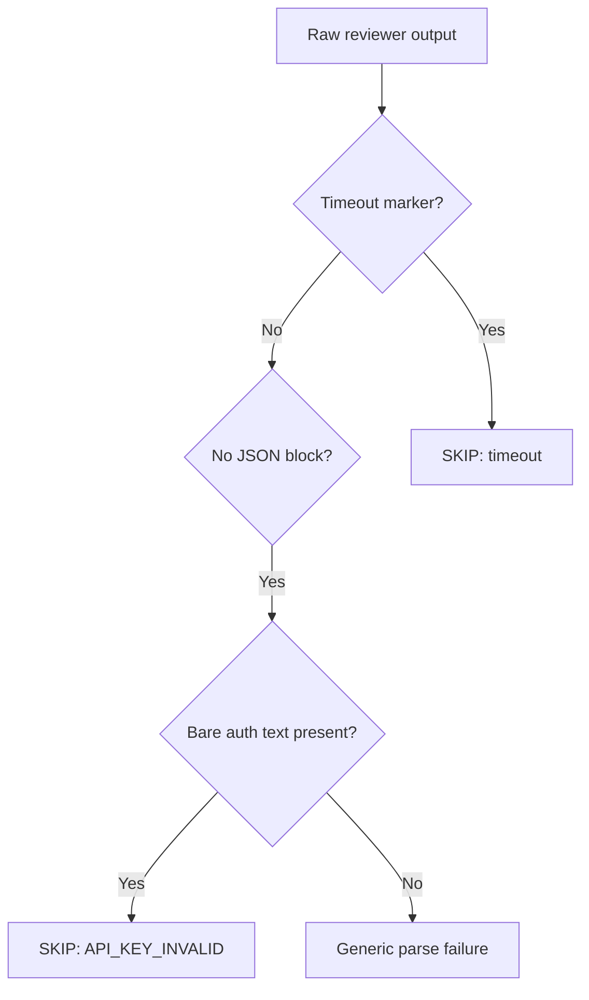
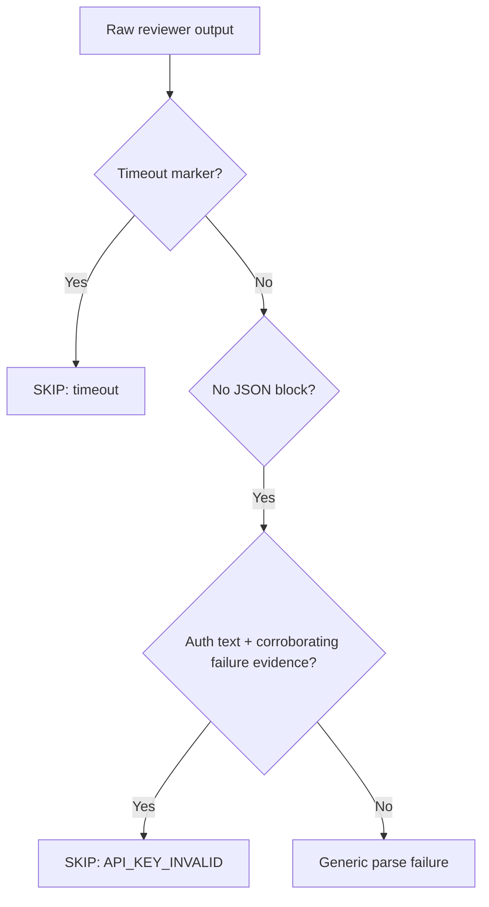
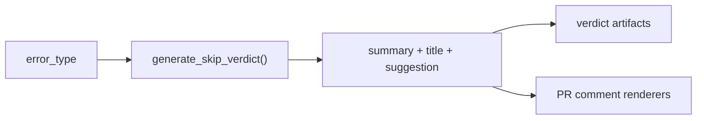

## Why This Matters

Cerberus was telling users to debug API keys when the real failure mode was a timeout or an unstructured provider response. That wastes time, hides the true root cause, and makes SKIP verdicts harder to trust as an operational signal.

This PR fixes issue #282 by tightening `parse-review.py` so incidental `authentication` text no longer becomes `API_KEY_INVALID`, while explicit timeout markers still win cleanly.

Closes #282

## Trade-offs / Risks

- The auth heuristic is narrower now, so it intentionally prefers generic parse-failure over falsely accusing the API key when evidence is ambiguous.
- I did not change the explicit `API Error:` path or downstream comment templates; the fix stays at the parser boundary where the misclassification starts.
- `make validate` still fails in `ruff` on unrelated pre-existing lint violations outside this diff, so the repo-wide gate is not fully green yet despite the full pytest pass.

## Intent Reference

Intent summary:
- Timeout output that happens to mention `authentication` must still emit a timeout SKIP, never `API_KEY_INVALID`.
- Ambiguous auth-adjacent unstructured output must only classify as auth failure when the evidence is unambiguous.
- Non-auth skip types like `RATE_LIMIT` must not point operators at API key debugging.

Source issue: https://github.com/misty-step/cerberus/issues/282

## Changes

- Tightened `looks_like_api_error()` in `scripts/parse-review.py` so bare `authentication` is no longer enough to classify `API_KEY_INVALID`.
- Kept timeout precedence intact and added regression coverage for timeout output that includes incidental auth wording.
- Made skip guidance error-specific for `RATE_LIMIT`, `SERVICE_UNAVAILABLE`, and generic `API_ERROR`.
- Added a walkthrough artifact and retro entry for the implementation lane.

## Alternatives Considered

- Do nothing: leaves developers chasing secrets for timeout/provider issues.
- Patch comment renderers only: rejected because the wrong structured error type would still propagate through artifacts and other consumers.
- Remove auth heuristics entirely: rejected because explicit unstructured auth failures without JSON would then lose useful classification.

## Acceptance Criteria

- [x] Given a reviewer that exits with code 124 and outputs `authentication`, the verdict is `timeout`, not `api_error`.
- [x] Given ambiguous auth-adjacent raw output without a timeout marker, the parser does not classify `authentication` alone as `API_KEY_INVALID`.
- [x] Given a `RATE_LIMIT` skip, downstream operator guidance no longer blames the API key.

## Manual QA

1. Run `python3 -m pytest tests/test_parse_review.py -q`
2. Run `python3 -m pytest tests/test_parse_review.py tests/test_render_findings.py tests/test_render_verdict_comment_helpers.py -q`
3. Run `make validate`
Expected:
- Targeted parser and rendering suites pass.
- `make validate` passes the full pytest phase (`1526 passed, 1 skipped`) and then fails on unrelated pre-existing `ruff` errors outside this PR.

## What Changed

Base branch flow:

This PR flow:

Skip-message contract:

Why this shape is better:
- The parser now owns the truth about failure type instead of letting a loose substring leak into every downstream surface.
- Error-specific guidance is emitted once at the source and reused everywhere.

## Before / After

Before:
- Timeout or ambiguous parse-failure output could surface as `API_KEY_INVALID`.
- `RATE_LIMIT` skips told maintainers to check API keys.

After:
- Timeout markers reliably stay timeouts even when provider output mentions authentication.
- Ambiguous auth wording falls back to parse-failure unless corroborated.
- Rate-limit and service issues now produce operator guidance that matches the actual failure mode.

Walkthrough artifact:
- https://github.com/misty-step/cerberus/blob/codex/issue-282-timeout-api-error/artifacts/pr-282-walkthrough.md

## Test Coverage

- `tests/test_parse_review.py`
  - Added timeout-vs-auth regression coverage.
  - Added ambiguous-auth parse-failure coverage.
  - Added rate-limit guidance regression coverage.
- `python3 -m pytest tests/test_parse_review.py tests/test_render_findings.py tests/test_render_verdict_comment_helpers.py -q`

Gap:
- No new end-to-end GitHub Actions run was executed from this branch.

## Merge Confidence

Medium-high.

Strongest evidence:
- Focused RED -> GREEN tests for the exact parser failure mode.
- Full `tests/test_parse_review.py` pass.
- Broader rendering-related regression pass.
- Full repo pytest phase passed inside `make validate`.

Residual risk:
- Repo-wide lint remains red because of unrelated pre-existing files, so the full standard quality gate is not green yet.
