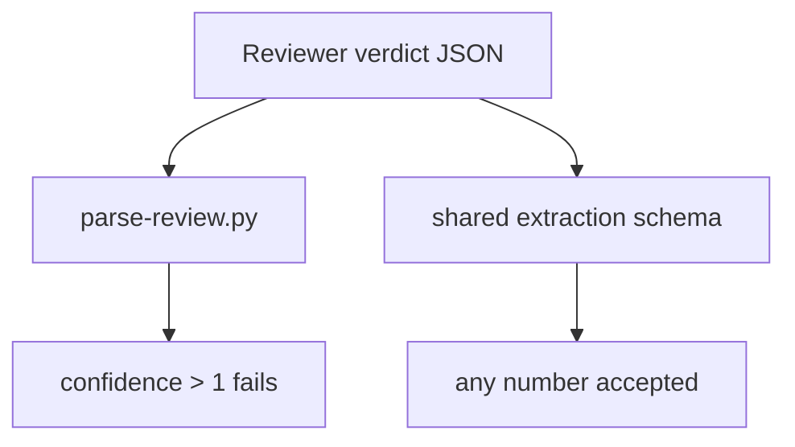
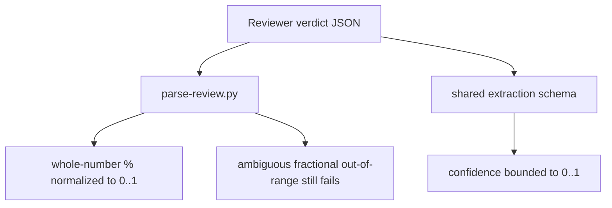
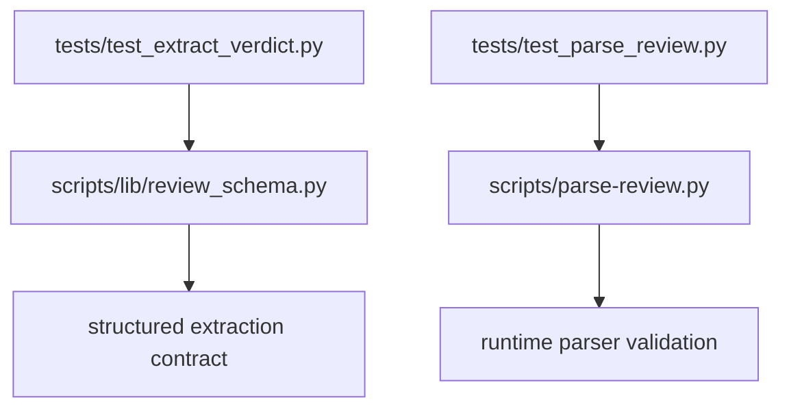

## Reviewer Evidence
- Start here: [issue-317 reviewer evidence](https://github.com/misty-step/cerberus/blob/cx/issue-317-normalize-confidence/walkthrough/issue-317-reviewer-evidence.md)
- Direct artifact: [pr-317 walkthrough](https://github.com/misty-step/cerberus/blob/cx/issue-317-normalize-confidence/artifacts/pr-317-walkthrough.md)
- Walkthrough notes: internal parser/schema fix; markdown evidence is the right proof shape.
- Fast claim: this branch stops false-negative review failures from `confidence: 100` while tightening the canonical extraction contract back to `0..1`.

## Why This Matters
- Problem: a reviewer PASS verdict with no findings could still fail Cerberus if it emitted `confidence: 100`, because the parser rejected it even though the extraction schema advertised any numeric confidence.
- Value: valid review runs stop failing on this contract mismatch, and the confidence contract is explicit in both schema and parser layers.
- Why now: issue #317 is an active `p1` reliability lane, and it maps directly to false-negative CI failures on downstream repositories.
- Issue: closes #317

## Trade-offs / Risks
- Value gained: valid percentage-style whole-number confidence values no longer trip the parser, and extraction contract drift is closed.
- Cost / risk incurred: the parser now contains one explicit normalization rule for whole-number percentages.
- Why this is still the right trade: the normalization is narrow, test-locked, and safer than forcing downstream reruns for clearly salvageable PASS verdicts.
- Reviewer watch-outs: if model outputs start using ambiguous fractional percentages like `1.5`, this branch still rejects them by design.

## Intent Reference

Source issue: [#317](https://github.com/misty-step/cerberus/issues/317)

Intent contract summary:
- preserve reviewer verdicts when confidence is clearly expressed as a whole-number percentage such as `100`
- keep the canonical contract unit-interval based
- reject ambiguous out-of-range values instead of silently inventing semantics
- lock both schema and parser behavior with regression tests

## Changes
- tightened `scripts/lib/review_schema.py` so extraction advertises `confidence` in `[0, 1]`
- updated `scripts/parse-review.py` to normalize whole-number percentage confidences before range validation
- added parser and schema regression coverage in `tests/test_parse_review.py` and `tests/test_extract_verdict.py`

## Alternatives Considered

### Option A — Do nothing
- Upside: no parser/schema churn.
- Downside: valid PASS verdicts keep failing downstream on a formatting mismatch.
- Why rejected: it preserves a known false-negative reliability bug.

### Option B — Normalize every value above 1
- Upside: broad salvage path.
- Downside: silently converts ambiguous values like `1.5` into `0.015`.
- Why rejected: that invents semantics where the output is unclear.

### Option C — Current approach
- Upside: salvages clearly percentage-style whole numbers and keeps the contract strict everywhere else.
- Downside: leaves ambiguous fractional out-of-range values failing until explicitly specified.
- Why chosen: it is the narrowest root-cause fix that resolves the observed failure mode without weakening the contract.

## Acceptance Criteria
- [x] A review payload with `confidence: 100` parses successfully and produces `confidence: 1.0`.
- [x] Fractional out-of-range confidence values such as `1.5` still fail validation.
- [x] The shared structured-extraction schema constrains `confidence` to `[0, 1]`.
- [x] `python3 -m pytest tests/test_parse_review.py tests/test_extract_verdict.py -q`
- [x] `make validate`

## Manual QA
1. Run `python3 -m pytest tests/test_parse_review.py tests/test_extract_verdict.py -q`.
   Expected: targeted parser/schema regression suite passes.
2. Run `make validate`.
   Expected: full repo tests pass, then `ruff` and `shellcheck` remain clean.

## What Changed

### Base Branch

### This PR

### Architecture / State Change

Why this is better:
- schema and parser now agree on the contract
- valid whole-number percentage outputs are salvaged at the parser boundary
- regression tests pin both sides of the contract

## Before / After
- Before: `confidence: 100` caused a false-negative parse failure even when the reviewer verdict was PASS with zero findings.
- After: `confidence: 100` is normalized to `1.0`, while ambiguous fractional out-of-range inputs still fail.
- Screenshots are not needed because this PR changes parser/schema behavior and test coverage, not a browser UI.

## Walkthrough
- Renderer: markdown walkthrough
- Artifact: [artifacts/pr-317-walkthrough.md](https://github.com/misty-step/cerberus/blob/cx/issue-317-normalize-confidence/artifacts/pr-317-walkthrough.md)
- Claim: the branch closes the confidence contract mismatch without loosening validation for ambiguous values
- Before / After scope: parser validation, shared extraction contract, and regression coverage
- Persistent verification: `make validate`

## Test Coverage
- `tests/test_parse_review.py`
- `tests/test_extract_verdict.py`
- full repo gate via `make validate`

Gap: this lane intentionally does not define semantics for ambiguous fractional percentages above `1`; that remains invalid until there is a stronger contract decision.

## Merge Confidence
- Confidence level: high
- Strongest evidence: targeted parser/schema suite passed (`187 passed`) and `make validate` passed (`1731 passed, 1 skipped`)
- Remaining uncertainty: only future model drift toward ambiguous fractional percentages, which this branch still rejects
- What could still go wrong after merge: a reviewer could emit a new malformed confidence shape not covered by the current contract
