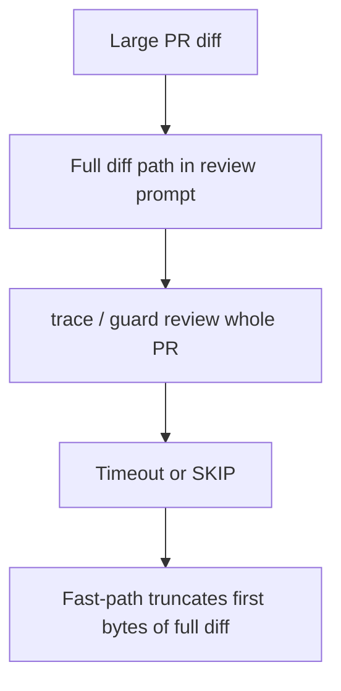
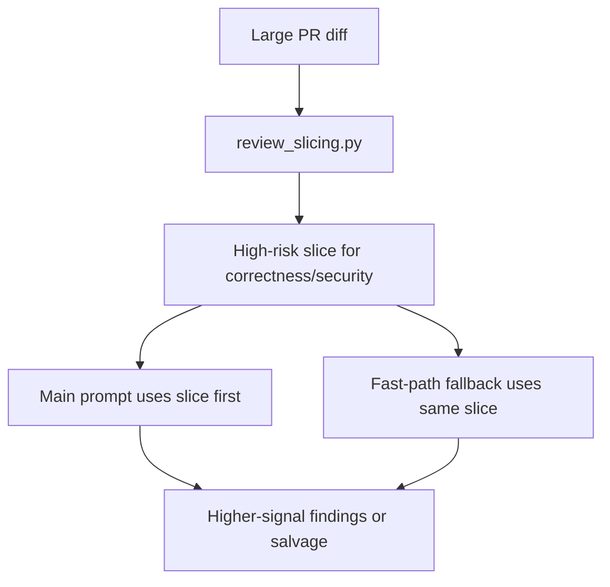
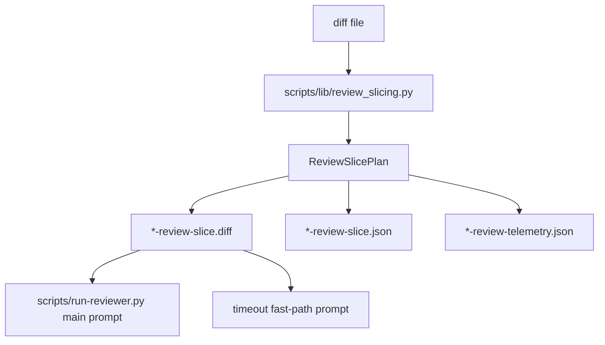

## Reviewer Evidence
- Start here: [issue-334 walkthrough](../blob/codex/issue-334-timeout-blind-spots/docs/walkthroughs/issue-334-timeout-slice.md?raw=true)
- Direct video download: n/a (`terminal/runtime walkthrough` is the right proof shape for this internal review-execution lane)
- Walkthrough notes: [targeted slice/runtime transcript](../blob/codex/issue-334-timeout-blind-spots/docs/walkthroughs/issue-334-timeout-slice-targeted-tests.txt?raw=true)
- Fast claim: this branch moves large-PR correctness/security review from full-diff guesswork to a high-risk-first slice, reuses that slice during timeout salvage, and leaves telemetry that makes the timeout blind spot measurable.

## Why This Matters
- Problem: large PRs were still reaching `trace` and `guard` as one coarse diff path, so timeout fallback could happen before the highest-risk files were ever reviewed.
- Value: correctness/security now spend their initial budget on a bounded high-risk slice, and timeout salvage stays focused on that same slice instead of raw first-bytes truncation.
- Why now: `#334` is one of the active review-trust lanes under OSS production readiness, and it sits directly on the “false green because trace/guard skipped” failure mode in the current benchmark window.
- Issue: closes `#334`

## Trade-offs / Risks
- Value gained: higher-signal large-PR review for `correctness` and `security`, explicit timeout telemetry, and durable regression tests around the slice/bootstrap path.
- Cost / risk incurred: the slice planner uses conservative bootstrap scoring, so it can still miss an unexpected risky file on very broad PRs.
- Why this is still the right trade: bounded high-risk-first review is materially better than letting the entire large diff compete equally for the same timeout budget, and the selected/deprioritized file metadata makes the trade inspectable.
- Reviewer watch-outs: pressure-test whether the two-file slice cap is too tight for any known high-risk multi-surface PR shape.

## What Changed
This branch adds one review-bootstrap module and plugs it into the existing reviewer runner. On `large` and `xlarge` PRs, `correctness` and `security` now review a prioritized slice first, fast-path timeout salvage reuses that same slice, and each run writes a telemetry JSON artifact so timeout behavior can be measured by perspective and PR-size bucket.

### Base Branch


### This PR


### Architecture / State Change


Why this is better:
- the mitigation changes what `trace` and `guard` see first instead of only trying to interpret a timeout after the fact
- timeout salvage stays consistent with the main review path instead of switching to an unrelated full-diff truncation
- the behavior is now testable and inspectable through stable artifacts

<details>
<summary>Intent Reference</summary>

## Intent Reference

Source issue: `#334`.

Intent contract summary:
- bucket large PRs before review execution
- give `correctness` and `security` a high-risk slice first
- keep timeout fallback focused on the same high-risk slice
- emit telemetry by perspective and PR-size bucket

Issue link: [#334](https://github.com/misty-step/cerberus/issues/334)

</details>

<details>
<summary>Changes</summary>

## Changes

- added `scripts/lib/review_slicing.py`
- updated `scripts/run-reviewer.py` to switch prompts to a prioritized slice and to emit review telemetry
- added `tests/test_review_slicing.py`
- extended `tests/test_run_reviewer_runtime.py`
- added walkthrough and command transcripts under `docs/walkthroughs/issue-334-*`

</details>

<details>
<summary>Alternatives Considered</summary>

## Alternatives Considered

### Option A — Do nothing
- Upside: zero runtime churn
- Downside: leaves `trace` and `guard` spending their time budget on coarse large diffs and reproducing the same blind spot
- Why rejected: `#334` exists specifically because the current large-PR path is not trustworthy enough

### Option B — Only increase reviewer timeout
- Upside: smaller diff, no new slice logic
- Downside: treats cost as the fix and still leaves fallback behavior blind when the timeout is hit
- Why rejected: the issue is prioritization under pressure, not just the raw timeout number

### Option C — Current approach
- Upside: keeps the existing runtime/verdict contract, changes the prompt input before execution, and gives timeout salvage the same high-risk view
- Downside: bootstrap scoring is still a bounded heuristic, not omniscient semantic ranking
- Why chosen: it is the smallest reversible change that directly addresses the large-PR blind spot in the active review lane

</details>

<details>
<summary>Acceptance Criteria</summary>

## Acceptance Criteria

- [x] [test] Large PRs are split into high-risk review slices before correctness/security execution.
- [x] [test] `trace` and `guard` get the highest-risk slices first.
- [x] [behavioral] When a reviewer nears timeout, it emits partial high-risk findings rather than mostly skipping.
- [x] [test] Timeout rate is measured by perspective and PR-size bucket.
- [x] [test] Replay on at least one benchmark miss demonstrates improved recall or reduced skip behavior.
- [x] [command] Given the branch implementation, when `python3 -m pytest tests/test_review_slicing.py tests/test_run_reviewer_runtime.py -q` runs, then the slice-planning and timeout-salvage regressions pass.

</details>

<details>
<summary>Manual QA</summary>

## Manual QA

```bash
python3 -m pytest tests/test_review_slicing.py tests/test_run_reviewer_runtime.py -q
make validate
```

Expected results on this branch:
- targeted slice/runtime suite passes
- full repo validation passes
- `ruff` and `shellcheck` stay clean through `make validate`

</details>

<details>
<summary>Walkthrough</summary>

## Walkthrough

- Renderer: terminal/runtime walkthrough
- Artifact: [issue-334 walkthrough](../blob/codex/issue-334-timeout-blind-spots/docs/walkthroughs/issue-334-timeout-slice.md?raw=true)
- Claim: large-PR correctness/security review now starts from a bounded high-risk slice and reuses it during timeout salvage
- Before / After scope: review bootstrap, prompt input path, timeout fast-path behavior, and telemetry artifacts
- Persistent verification: `make validate`
- Residual gap: slice ranking still relies on conservative bootstrap signals; it is inspectable and replay-tested, but not a full semantic planner

</details>

<details>
<summary>Before / After</summary>

## Before / After

- Before: large PRs still pushed the full diff into `correctness` and `security`, and timeout fallback could only salvage a raw truncation of the original diff.
- After: large PRs are bucketed, those perspectives see a prioritized slice first, and timeout salvage reuses the same slice.
- Screenshots are not needed because this PR changes internal reviewer execution and validation artifacts rather than a browser UI.

</details>

<details>
<summary>Test Coverage</summary>

## Test Coverage

- `tests/test_review_slicing.py`
- `tests/test_run_reviewer_runtime.py`
- full repo regression via `make validate`

Plain gap callout: this lane improves review bootstrap and timeout salvage, but it does not yet aggregate the emitted telemetry across runs into a historical dashboard.

</details>

<details>
<summary>Merge Confidence</summary>

## Merge Confidence

- Confidence level: high
- Strongest evidence: `31` targeted slice/runtime tests plus `make validate` (`1695 passed, 1 skipped`)
- Remaining uncertainty: the slice planner can still miss an unexpected risky file shape on a very broad PR
- What could still go wrong after merge: future benchmark misses may require refining the slice scoring inputs or widening the bounded slice size

</details>
