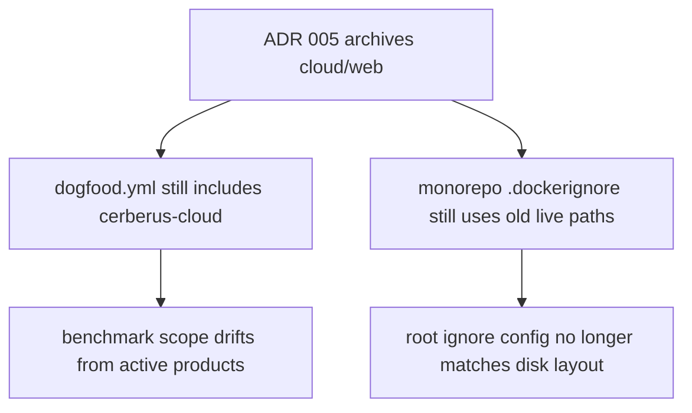
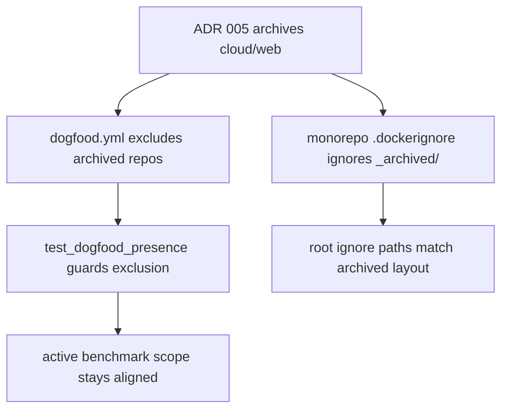
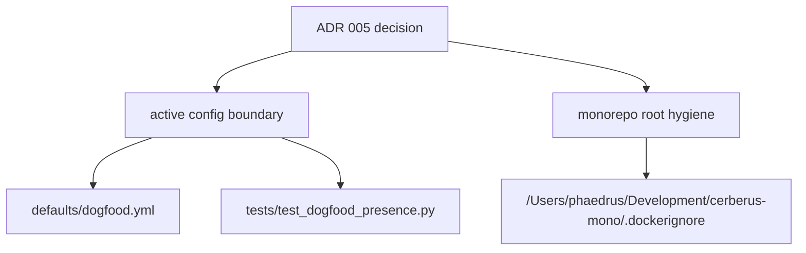

## Reviewer Evidence
- Start here: [issue-416 walkthrough](../blob/cx/issue-416-archive-cleanup/artifacts/issue-416-archive-cleanup-walkthrough.md?raw=true)
- Direct video download: n/a (`config and root-cleanup walkthrough` is the right proof shape for this internal lane)
- Walkthrough notes: [issue-416 walkthrough](../blob/cx/issue-416-archive-cleanup/artifacts/issue-416-archive-cleanup-walkthrough.md?raw=true)
- Fast claim: this branch removes archived Cerberus products from active dogfood targets, adds a regression test so they stay out, and documents the matching monorepo-root `.dockerignore` fix applied outside this repo boundary.

## Why This Matters
- Problem: ADR 005 archived Cerberus Cloud and Cerberus Web, but active dogfood config still treated `misty-step/cerberus-cloud` as a live benchmark target and the monorepo-root `.dockerignore` still pointed at pre-archive paths.
- Value: benchmark presence now reflects only active repos, archived products cannot silently re-enter the dogfood target set, and the monorepo root ignores the actual archived tree.
- Why now: `#416` is the remaining open child under the migration epic, and stale archive references keep the backlog and validation story inconsistent after the OSS-only decision.
- Issue: closes `#416`

## Trade-offs / Risks
- Value gained: active benchmark config now matches ADR 005 and has a test guard against regression.
- Cost / risk incurred: part of the issue closure lives outside this repo’s git boundary, so the root `.dockerignore` fix is evidenced in the walkthrough rather than in the branch diff.
- Why this is still the right trade: the repo-side config drift needed a real commit, while the monorepo-root ignore fix needed a manual local update in the only place that file exists.
- Reviewer watch-outs: pressure-test whether any other active config, beyond historical docs and ADRs, still treats archived products as live targets.

## What Changed
This branch removes the archived `cerberus-cloud` repo from the active dogfood presence target list and adds a regression test that keeps archived products out of that config. In parallel with the repo diff, the monorepo-root `.dockerignore` was updated manually to ignore `_archived/`, which is where the archived products now live.

### Base Branch


### This PR


### Architecture / State Change


Why this is better:
- active benchmark inputs now reflect live products instead of archived ones
- the archive boundary is enforced by a test instead of remembered informally
- the monorepo root now ignores the archived tree at the path that actually exists

<details>
<summary>Intent Reference</summary>

## Intent Reference

Source issue: `#416`.

Intent summary:
- keep archived Cerberus Cloud and Cerberus Web out of active repo and root-level config
- verify monorepo root files no longer point at dead live-product paths
- leave only intentional historical references in ADRs and benchmark history

Issue link: [#416](https://github.com/misty-step/cerberus/issues/416)

</details>

<details>
<summary>Changes</summary>

## Changes

- updated `defaults/dogfood.yml`
- added an archive-exclusion guard in `tests/test_dogfood_presence.py`
- added walkthrough evidence in `artifacts/issue-416-archive-cleanup-walkthrough.md`
- manually updated `/Users/phaedrus/Development/cerberus-mono/.dockerignore` outside this repo boundary

</details>

<details>
<summary>Alternatives Considered</summary>

## Alternatives Considered

### Option A — Do nothing
- Upside: no repo churn
- Downside: benchmark scope stays inconsistent with ADR 005 and archived repos can drift back into active config unnoticed
- Why rejected: `#416` exists because that inconsistency is still open work

### Option B — Manual root cleanup only
- Upside: smallest possible local change
- Downside: leaves the shipped repo config wrong and unguarded
- Why rejected: active benchmark targets live in this repo, so the fix needs a real branch diff

### Option C — Current approach
- Upside: fixes the active config at the source, adds a regression test, and documents the required root-side manual fix
- Downside: the root `.dockerignore` evidence is outside the branch diff
- Why chosen: it is the smallest complete slice that actually closes the active drift

</details>

<details>
<summary>Acceptance Criteria</summary>

## Acceptance Criteria

- [x] Root monorepo `CLAUDE.md` and `AGENTS.md` are aligned with ADR 005 and contain no stale cloud/web references.
- [x] No monorepo-root CI/config references cloud/web live paths after the `.dockerignore` fix.
- [x] Active dogfood config in this repo no longer includes archived Cerberus products.
- [x] A regression test guards the active-config archive boundary.

</details>

<details>
<summary>Manual QA</summary>

## Manual QA

```bash
python3 -m pytest tests/test_dogfood_presence.py -q
make validate
rg -n "cerberus-cloud|cerberus-web" \
  /Users/phaedrus/Development/cerberus-mono/AGENTS.md \
  /Users/phaedrus/Development/cerberus-mono/CLAUDE.md \
  /Users/phaedrus/Development/cerberus-mono/.dockerignore \
  /Users/phaedrus/Development/cerberus-mono/.github 2>/dev/null
```

Expected results:
- targeted dogfood suite passes
- full repo validation passes
- root-level grep returns no matches

</details>

<details>
<summary>Walkthrough</summary>

## Walkthrough

- Renderer: markdown walkthrough
- Artifact: [issue-416 walkthrough](../blob/cx/issue-416-archive-cleanup/artifacts/issue-416-archive-cleanup-walkthrough.md?raw=true)
- Claim: archived Cerberus products are no longer treated as active dogfood targets, and the monorepo root ignores the archived tree at the correct path
- Before / After scope: active dogfood config, regression coverage, and monorepo-root ignore path
- Persistent verification: `make validate`
- Residual gap: historical benchmark docs still mention archived repos intentionally, so reviewers should distinguish evidence history from active config

</details>

<details>
<summary>Before / After</summary>

## Before / After

- Before: active config still counted `misty-step/cerberus-cloud` as a core dogfood repo, and the monorepo root still ignored dead live-product paths instead of `_archived/`.
- After: active config excludes archived repos, a test locks that boundary, and the monorepo root ignores the actual archived tree.
- Screenshots are not needed because this PR changes configuration and test contracts rather than a browser surface.

</details>

<details>
<summary>Test Coverage</summary>

## Test Coverage

- `tests/test_dogfood_presence.py`
- full repo regression via `make validate`

Gap callout: the monorepo-root `.dockerignore` change is verified by command output, not by a test in this repo, because that file lives outside the repo boundary.

</details>

<details>
<summary>Merge Confidence</summary>

## Merge Confidence

- Confidence level: high
- Strongest evidence: `make validate` passed (`1894 passed, 1 skipped`) and all three triad reviewers said `Ship`
- Remaining uncertainty: reviewers still need to trust walkthrough evidence for the root `.dockerignore` update because it is not in this repo diff
- What could still go wrong after merge: another active config file could still reference archived repos if it was missed outside the current grep scope

</details>
