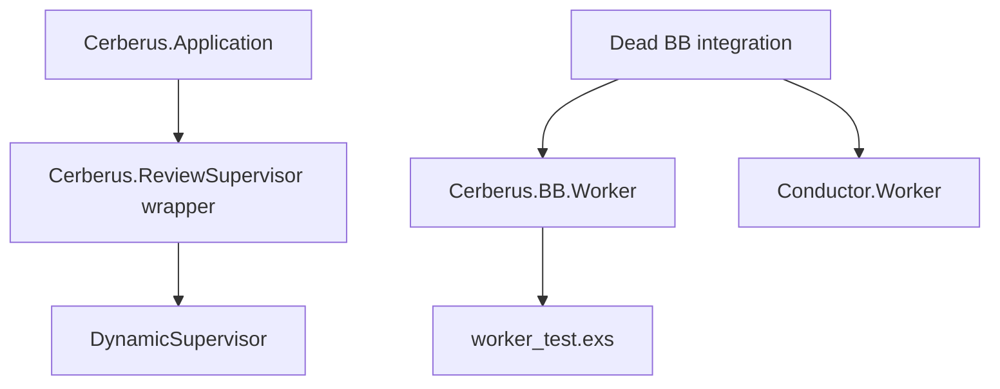
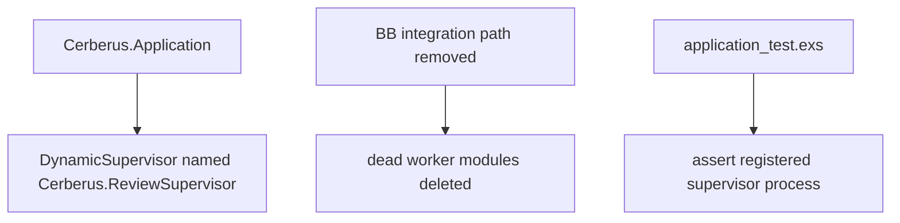
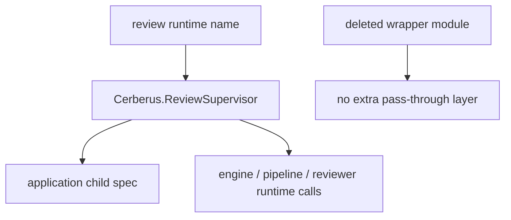

## Reviewer Evidence
- Start here: [issue-448 walkthrough](../blob/cx/issue-448-elixir-cleanup/artifacts/issue-448-elixir-cleanup-walkthrough.md?raw=true)
- Direct video download: n/a (`markdown walkthrough` is the right proof shape for this internal Elixir refactor)
- Walkthrough notes: [issue-448 walkthrough](../blob/cx/issue-448-elixir-cleanup/artifacts/issue-448-elixir-cleanup-walkthrough.md?raw=true)
- Fast claim: this branch removes dead BB worker code, deletes the shallow review supervisor wrapper, and preserves the runtime supervisor name by inlining the dynamic supervisor child spec.

## Why This Matters
- Problem: the Elixir app carried dead BB integration code and a pass-through `ReviewSupervisor` module that added surface area without behavior.
- Value: the supervision tree is now simpler, dead modules and dead tests are gone, and the application test asserts the real runtime contract instead of a wrapper module name.
- Why now: `#448` is a small `p1` cleanup in the Elixir migration epic, and it is exactly the kind of shallow-module debt that compounds if left behind.
- Issue: closes `#448`

## Trade-offs / Risks
- Value gained: less dead code, one fewer shallow module, and a more truthful supervision-tree test.
- Cost / risk incurred: the issue's literal `ReviewSupervisor` grep criterion cannot be satisfied without violating the boundary to preserve the runtime supervisor name.
- Why this is still the right trade: the real architectural win is deleting the wrapper module while keeping the stable runtime name that existing engine and pipeline code already depend on.
- Reviewer watch-outs: pressure-test whether any remaining `ReviewSupervisor` references imply a missing deeper simplification, or whether they are the legitimate runtime-name dependency this lane intentionally keeps.

## What Changed
This branch deletes the abandoned BB worker path, inlines the review dynamic supervisor directly in `Cerberus.Application`, and updates the supervision-tree test to verify the registered supervisor process instead of a wrapper module.

### Base Branch


### This PR


### Architecture / State Change


Why this is better:
- the application owns the supervisor child spec directly instead of hiding it behind a 14-line wrapper
- dead BB code and its dead test stop competing for reader attention
- the remaining test checks the runtime behavior that actually matters: the named supervisor process exists and is usable

<details>
<summary>Intent Reference</summary>

## Intent Reference

Source issue: `#448`.

Intent summary:
- delete the abandoned BB worker path
- remove the shallow `Cerberus.ReviewSupervisor` module
- inline the dynamic supervisor child while preserving the `Cerberus.ReviewSupervisor` runtime name
- keep the Elixir test suite green after the cleanup

Issue link: [#448](https://github.com/misty-step/cerberus/issues/448)

</details>

<details>
<summary>Changes</summary>

## Changes

- updated `cerberus-elixir/lib/cerberus/application.ex`
- deleted `cerberus-elixir/lib/cerberus/bb/worker.ex`
- deleted `cerberus-elixir/lib/conductor/worker.ex`
- deleted `cerberus-elixir/lib/cerberus/review_supervisor.ex`
- updated `cerberus-elixir/test/application_test.exs`
- deleted `cerberus-elixir/test/worker_test.exs`
- added `artifacts/issue-448-elixir-cleanup-walkthrough.md`

</details>

<details>
<summary>Alternatives Considered</summary>

## Alternatives Considered

### Option A — Do nothing
- Upside: zero branch churn
- Downside: dead BB code and the shallow supervisor wrapper keep polluting the Elixir surface
- Why rejected: `#448` exists specifically to pay down that dead weight

### Option B — Keep the wrapper and only delete the BB worker path
- Upside: slightly smaller diff
- Downside: leaves the shallowest module in the lane untouched
- Why rejected: the wrapper adds no policy, invariants, or abstraction value

### Option C — Current approach
- Upside: deletes the dead path and the shallow supervisor layer in one reversible slice
- Downside: the issue's grep wording needs intent-based interpretation because the runtime name must stay alive
- Why chosen: it is the smallest diff that removes the real design debt without introducing a new abstraction

</details>

<details>
<summary>Acceptance Criteria</summary>

## Acceptance Criteria

- [x] [command] `cd cerberus-elixir && grep -R "BB.Worker\\|Conductor.Worker" lib/ test/` returns no matches.
- [x] [command] The `Cerberus.ReviewSupervisor` wrapper module is deleted and `application.ex` now inlines `{DynamicSupervisor, name: Cerberus.ReviewSupervisor, strategy: :one_for_one}`. Remaining references preserve the runtime name required by the issue boundary.
- [x] [test] `cd cerberus-elixir && mix test` passes.

</details>

<details>
<summary>Manual QA</summary>

## Manual QA

```bash
cd cerberus-elixir
grep -R "BB.Worker\|Conductor.Worker" lib/ test/
grep -R "ReviewSupervisor" lib/ test/
mix compile --warnings-as-errors
mix test
```

Expected results:
- dead worker grep returns no matches
- `ReviewSupervisor` grep shows the inlined application child spec plus required runtime-name references
- warnings-as-errors compile passes
- test suite passes

</details>

<details>
<summary>Walkthrough</summary>

## Walkthrough

- Renderer: markdown walkthrough
- Artifact: [issue-448 walkthrough](../blob/cx/issue-448-elixir-cleanup/artifacts/issue-448-elixir-cleanup-walkthrough.md?raw=true)
- Claim: the Elixir supervision tree is simpler because the wrapper module is gone, while the stable runtime supervisor name still exists for reviewer execution
- Before / After scope: dead modules, application child spec, and supervision-tree test contract
- Persistent verification: `cd cerberus-elixir && mix test && mix compile --warnings-as-errors`
- Residual gap: the issue's strict grep wording should be read together with the explicit boundary to preserve the runtime supervisor name

</details>

<details>
<summary>Before / After</summary>

## Before / After

- Before: `Cerberus.Application` started a wrapper module, dead BB worker files still existed, and the application test only asserted that wrapper module name.
- After: the application starts the named `DynamicSupervisor` directly, the dead worker path is deleted, and the application test checks the actual named supervisor process.
- Screenshots are not needed because this PR changes internal Elixir runtime structure rather than a browser surface.

</details>

<details>
<summary>Test Coverage</summary>

## Test Coverage

- `cerberus-elixir/test/application_test.exs`
- full Elixir suite via `cd cerberus-elixir && mix test`
- compile gate via `cd cerberus-elixir && mix compile --warnings-as-errors`

Gap callout: the issue's second acceptance criterion is architecturally inconsistent as written, so verification is based on deleting the wrapper module while preserving required runtime references.

</details>

<details>
<summary>Merge Confidence</summary>

## Merge Confidence

- Confidence level: high
- Strongest evidence: dead worker grep is empty, `mix compile --warnings-as-errors` passed, and `mix test` passed with `330 tests, 0 failures`
- Remaining uncertainty: only the issue's wording, not the code path, is ambiguous
- What could still go wrong after merge: if reviewers want to eliminate every remaining `ReviewSupervisor` literal, that would require a separate design discussion about the stable runtime name rather than more deletion in this lane

</details>
