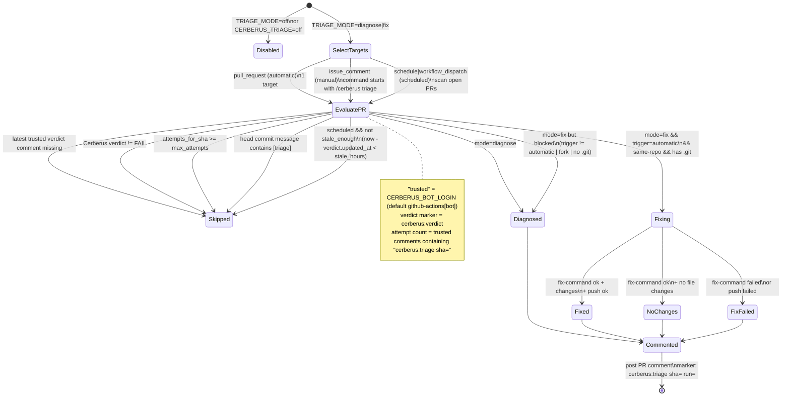
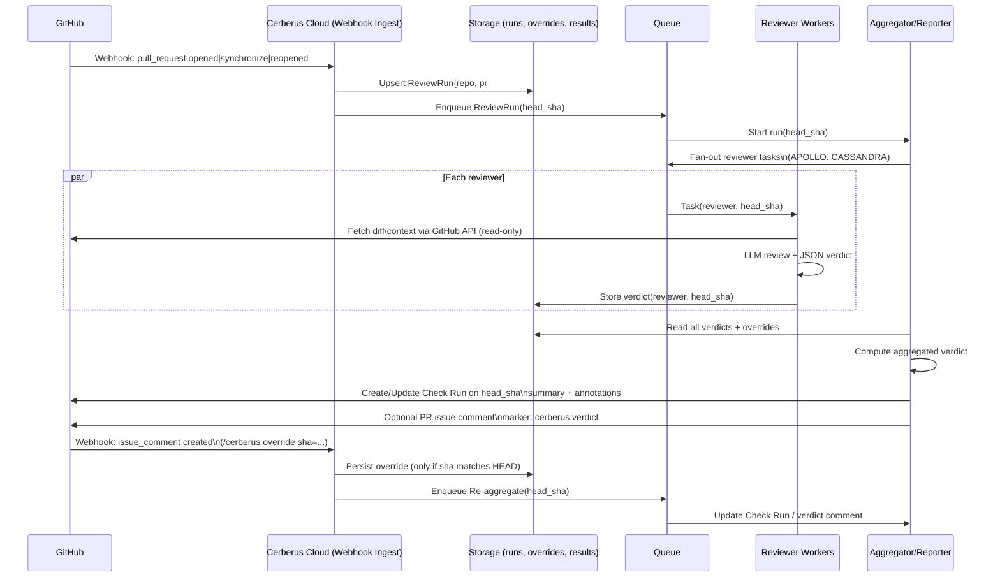

# Diagrams

## OSS GitHub Action Flow

```mermaid
flowchart TD
  PR[GitHub PR event\nopened|synchronize|reopened] --> MATRIX[Matrix job\nuses: cerberus/matrix@v2\noutputs: strategy.matrix JSON]

  MATRIX --> REVIEW_FANOUT[Review job\nstrategy.matrix = JSON\nfail-fast: false]

  REVIEW_FANOUT -->|N parallel jobs| REVIEW[action.yml\nuses: cerberus@v2\n(single perspective)]

  REVIEW --> CTX[Fetch PR diff + context\n(gh pr diff/view)]
  CTX --> LLM[Run reviewer\n(opencode run --agent <perspective>)]
  LLM --> PARSE[Parse reviewer output -> verdict.json\nscripts/parse-review.py]

  PARSE -->|uploads| ART[(Artifacts\ncerberus-verdict-<perspective>)]
  PARSE -->|optional| RCOMMENT[PR issue comment\nmarker: cerberus:<perspective>]

  ART --> VERDICT[Verdict job\nuses: cerberus/verdict@v2]

  OVERRIDE[/PR comment command\n/cerberus override sha=<sha>\n(reason required)/] --> VERDICT

  VERDICT --> AGG[Aggregate verdicts + apply overrides\nscripts/aggregate-verdict.py]
  AGG --> CCOMMENT[PR issue comment\nmarker: cerberus:verdict]
  AGG --> INLINE[PR review\ninline comments (best-effort, capped)]
  AGG --> CHECK[Final job conclusion\n(fail-on-verdict gates merge)]
```

## Triage Flow (Loop Guards)



## Cerberus Cloud (Proposed) GitHub App Flow



