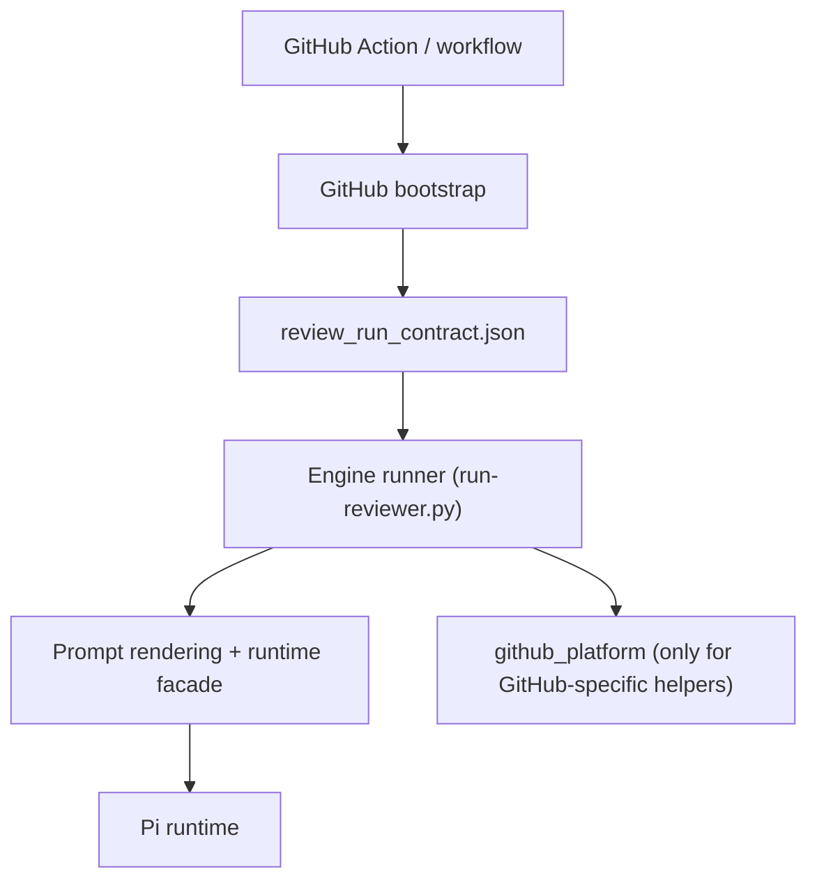

# ADR 004: Review Execution Boundary via Review-Run Contract

- Status: Accepted
- Date: 2026-03-12
- Deciders: Cerberus maintainers
- Related: #323, #324, #325, #326, #328

## Context

Cerberus currently ships as a GitHub Action, but the engine path still consumes GitHub-shaped bootstrap data directly:
- `GH_DIFF_FILE`
- `GH_PR_CONTEXT`
- `GH_TOKEN`
- `CERBERUS_REPO`
- `CERBERUS_PR_NUMBER`

That leaks GitHub Actions semantics into engine code and makes self-hosted or future Cloud orchestration harder to support without re-implementing the runner.

At the same time, GitHub CLI transport logic had drifted across multiple review/reporting scripts, which made the platform boundary shallow and harder to reason about.

## Decision

1. Introduce a provider-agnostic **review-run contract** as the engine input for review execution.
2. Keep the GitHub Action as the default OSS distribution, but have it write the contract before invoking the engine runner.
3. Keep GitHub-specific `gh` transport and retry/permission behavior behind `scripts/lib/github_platform.py`.
4. Preserve current public behavior for the GitHub Action path while making the internal boundary explicit.
5. Route review-path GitHub reads and writes through that adapter, including comment fetch/write helpers, PR review reads/writes, and PR file metadata reads.

## Boundary

- **Inside the engine boundary**
  - review-run contract loading
  - prompt rendering
  - runtime execution
  - parse handoff

- **Inside the GitHub platform boundary**
  - `gh` transport
  - retry/permission classification for GitHub calls
  - review/report helper calls that talk to GitHub APIs
  - PR comment reads and writes
  - PR review listing and creation
  - PR file metadata retrieval

- **Outside scope for this boundary**
  - Cloud billing, worker leasing, quotas, or Sprite orchestration
  - verdict schema redesign
  - prompt-policy redesign

## Contract Fields

The current contract is documented in `docs/review-run-contract.md`. The stable
surface for the GitHub lane is:

- repository identity: `repository`
- PR identity: `pr_number`
- branch refs: `head_ref`, `base_ref`
- prompt inputs: `diff_file`, `pr_context_file`
- runtime output root: `temp_dir`
- GitHub auth/context binding: `github.repo`, `github.pr_number`, `github.token_env_var`

## Consequences

### Positive

- Engine code now has a stable input shape that is not tied to raw GitHub env names.
- GitHub-specific logic has one clearer home.
- Future self-hosted or alternate orchestrators can target the contract instead of reusing Action-only glue.
- Tests and docs can guard against accidental recoupling.

### Negative

- The GitHub Action path now has one more artifact to manage.
- Legacy env fallbacks must remain for compatibility during migration.

## Extension Points

- If a new review-path feature needs direct GitHub CLI or GitHub API transport, extend `scripts/lib/github_platform.py`.
- If a change belongs to fetch/bootstrap setup before the engine runs, extend the GitHub workflow bootstrap.
- Do not add raw `gh` transport directly to engine-path modules such as `run-reviewer.py`, `review_run_contract.py`, `runtime_facade.py`, `github.py`, `github_reviews.py`, or their review-path callers.
- Compatibility wrappers may preserve caller-visible contracts, but their transport must still route through `github_platform`.

## Alternatives Considered

1. Keep raw `GH_*` env bootstrap in engine code.
   - Rejected: preserves hidden GitHub coupling.
2. Rewrite the entire workflow bootstrap path in one PR.
   - Rejected: too much risk for one lane.
3. Build a Cloud-specific execution layer first.
   - Rejected: violates OSS boundary goals and expands scope unnecessarily.
