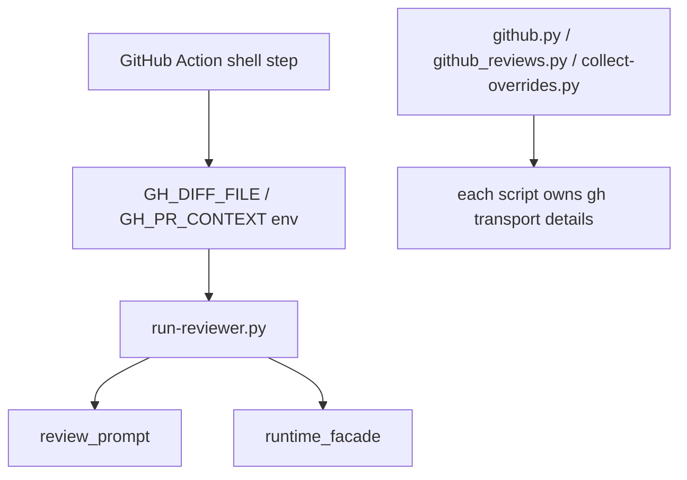
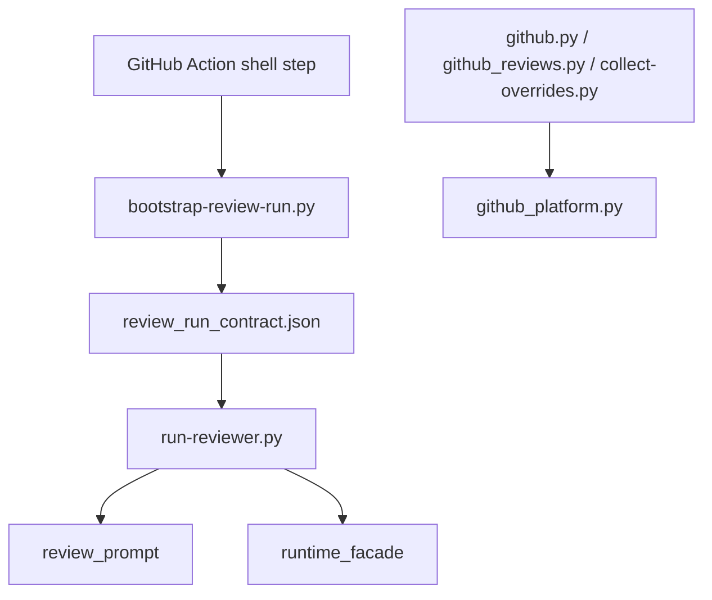

# Issue #323 Walkthrough: Review Execution Boundary

## Reviewer Evidence

- Core claim: Cerberus review execution now has an explicit provider-agnostic review-run contract, and GitHub review/reporting helpers route `gh` transport through a named `github_platform` boundary instead of each script owning its own wrapper.
- Primary artifact: terminal walkthrough with real branch execution evidence.
- Persistent verification: `make validate`

## Walkthrough

### What was wrong before

- Engine code in `scripts/run-reviewer.py` depended directly on GitHub bootstrap env such as `GH_DIFF_FILE` and `GH_PR_CONTEXT`.
- GitHub CLI transport logic was duplicated across review/report helpers, which made the platform boundary shallow and easy to recouple.

### What changed on this branch

- Added `scripts/lib/review_run_contract.py` as the engine input contract.
- Added `scripts/bootstrap-review-run.py` so the GitHub Action writes the contract before invoking the runner.
- Updated `action.yml`, `scripts/run-reviewer.py`, and `scripts/lib/review_prompt.py` so engine execution prefers the contract while preserving legacy fallback envs.
- Added `scripts/lib/github_platform.py` and routed shared GitHub transport through it, while keeping compatibility seams in `scripts/lib/github.py`, `scripts/lib/github_reviews.py`, and `scripts/collect-overrides.py`.
- Added ADR `004-review-execution-boundary.md` plus focused regression tests for the new boundary.

### What is true after

- The review engine can load its execution context from a stable contract file instead of requiring raw GitHub bootstrap fields.
- GitHub-specific transport behavior has one named home, and existing callers keep their public surface.
- The GitHub Action path remains backward compatible and still passes the repo quality gate.

## Execution Proof

### Focused boundary suite

```text
$ python3 -m pytest tests/test_github_reviews.py tests/test_collect_overrides.py tests/test_post_verdict_review.py tests/test_pr_context_bootstrap.py tests/test_github.py tests/test_verdict_action.py tests/test_run_reviewer_runtime.py tests/test_review_prompt_project_context.py tests/test_review_run_contract.py -q
159 passed in 11.76s
```

### Full repo gate

```text
$ make validate
1578 passed, 1 skipped in 47.03s
ruff clean
shellcheck clean
```

## Before / After Shape

### Before



### After



## Why the new shape is better

- The engine boundary is explicit and documented.
- Future non-Actions callers can target the contract instead of replaying GitHub-specific env wiring.
- GitHub transport behavior is centralized without forcing every existing helper or test to change its public surface in one PR.

## Residual Gap

- The GitHub Action fetch step still performs the raw `gh pr diff` / `gh pr view` bootstrap inline in `action.yml`; this lane narrows the engine boundary and review/report transport first without rewriting the full workflow bootstrap stack in one pass.
