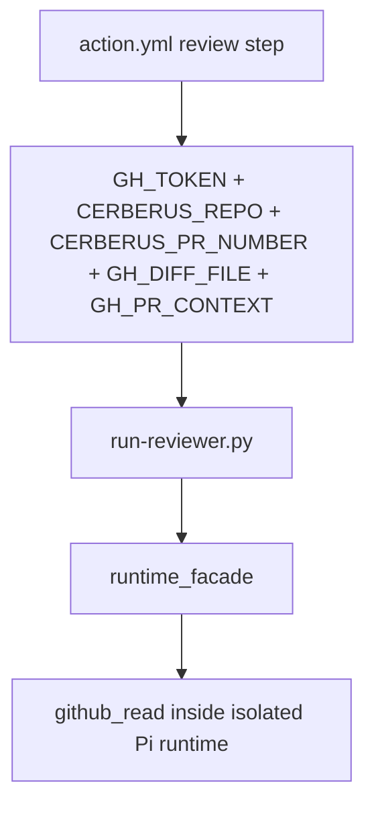
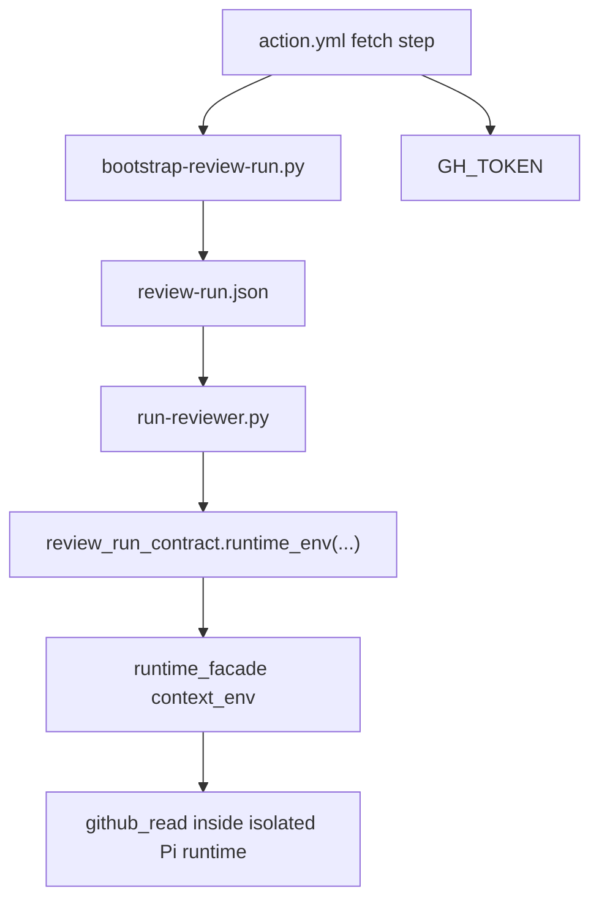
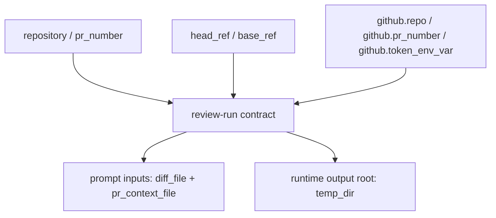

# Issue #324 Walkthrough: Review-Run Contract Completes the Engine Boundary

## Reviewer Evidence

- Core claim: the GitHub Action now boots review execution from the review-run contract instead of wiring repo/PR scope directly into the runner env.
- Primary artifact: terminal verification from this branch.
- Persistent verification: `make validate`

## What Changed

- `scripts/lib/review_run_contract.py` now carries branch refs and can reconstruct the GitHub runtime env from contract identity plus auth binding.
- `scripts/bootstrap-review-run.py` now extracts `head_ref` and `base_ref` from fetched PR context and writes them into `review-run.json`.
- `scripts/lib/runtime_facade.py` now accepts explicit runtime context env so isolated Pi runs do not depend on outer-process GitHub bootstrap vars.
- `scripts/run-reviewer.py` now passes contract-derived runtime context into the Pi attempt path.
- `action.yml` now maps the GitHub lane onto `CERBERUS_REVIEW_RUN` instead of exporting `CERBERUS_REPO`, `CERBERUS_PR_NUMBER`, `GH_DIFF_FILE`, and `GH_PR_CONTEXT` into the normal review step.
- Maintainer docs now define the review-run contract explicitly in `docs/review-run-contract.md`.

## Execution Proof

### Focused contract and runtime suite

```text
$ python3 -m pytest tests/test_review_run_contract.py tests/test_bootstrap_review_run.py tests/test_runtime_facade.py tests/test_github_read_integration.py tests/test_run_reviewer_runtime.py tests/test_review_prompt_project_context.py tests/test_verdict_action.py tests/test_run_reviewer_helpers.py -q
118 passed in 13.02s
```

### Full repo gate

```text
$ make validate
1625 passed, 1 skipped in 48.13s
ruff clean
shellcheck clean
```

## Before / After Shape

### Before



### After



### Contract Surface



## Why the New Shape Is Better

- The engine now receives one explicit bootstrap contract instead of a pile of GitHub-shaped env wiring.
- GitHub auth and repo/PR scope still reach the isolated runtime, but they are derived from the contract instead of being action-only plumbing.
- Legacy env fallbacks remain available for compatibility, while the primary GitHub Action path now proves the intended boundary.
