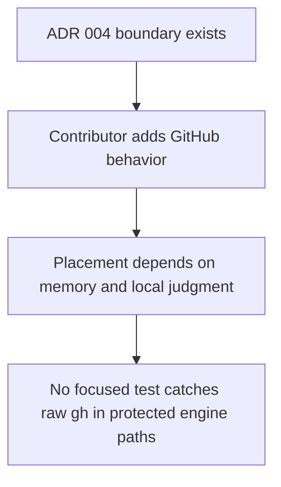
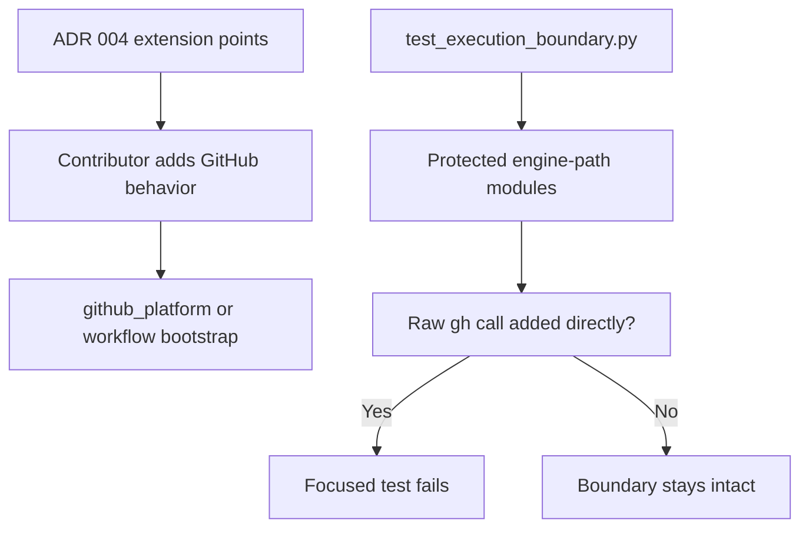

# Issue #328 Walkthrough: Execution Boundary Guard

## Reviewer Evidence

- Core claim: Cerberus now has a regression test and ADR guidance that keep raw `gh` transport out of protected engine-path modules while preserving the existing GitHub Action contract path.
- Primary artifact: terminal walkthrough with real branch execution evidence.
- Persistent verification: `python3 -m pytest tests/test_execution_boundary.py tests/test_bootstrap_review_run.py tests/test_review_run_contract.py tests/test_github_read_integration.py -q`

## Walkthrough

### What was missing before

- ADR 004 explained the review-run contract and `github_platform` boundary, but it did not tell contributors exactly where new GitHub-specific behavior should land.
- The repo had no focused regression test that would fail if a protected engine-path module embedded raw `gh` transport directly.

### What changed on this branch

- Added `tests/test_execution_boundary.py` to guard protected engine-path modules against direct raw `gh` subprocess calls.
- Extended `docs/adr/004-review-execution-boundary.md` with explicit extension-point guidance for `github_platform` and workflow bootstrap changes.
- Enriched issue `#328` with product spec, intent contract, technical design, affected files, and verification commands before implementation.

### What is true after

- Protected engine-path modules now fail a focused regression suite if they embed raw `gh` transport directly.
- ADR 004 now tells contributors to extend `scripts/lib/github_platform.py` for review-path transport and workflow bootstrap for pre-engine setup.
- The existing GitHub lane contract tests still pass unchanged, so the new guardrail does not regress the current bootstrap path.

## Execution Proof

### RED -> GREEN boundary suite

```text
$ python3 -m pytest tests/test_execution_boundary.py tests/test_bootstrap_review_run.py tests/test_review_run_contract.py tests/test_github_read_integration.py -q
2 failed, 14 passed in 0.11s

$ python3 -m pytest tests/test_execution_boundary.py tests/test_bootstrap_review_run.py tests/test_review_run_contract.py tests/test_github_read_integration.py -q
16 passed in 0.08s
```

### Transport compatibility slice

```text
$ python3 -m pytest tests/test_github_platform.py tests/test_github.py tests/test_github_reviews.py -q
51 passed in 0.13s
```

### Full repo gate

```text
$ make validate
1641 passed, 1 skipped in 48.50s
ruff clean
shellcheck clean
```

## Before / After Shape

### Before



### After



## Why the new shape is better

- The execution boundary is now both documented and enforced.
- Contributors get one named place for GitHub transport work instead of inferring it from scattered history.
- The new guard stays narrow: it protects engine-path modules without blocking unrelated maintenance tooling.

## Residual Gap

- The guard test focuses on direct subprocess call sites in protected Python modules. It does not attempt to police every repo script or every possible indirect shell wrapper outside the documented execution boundary.
