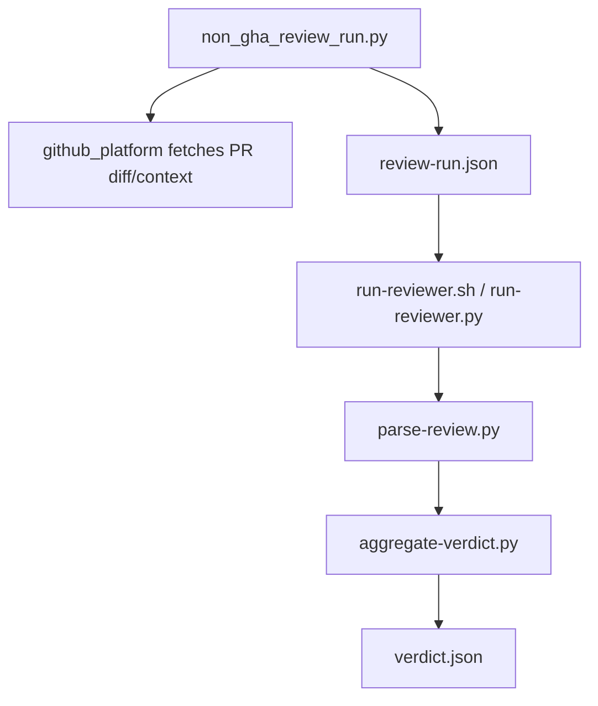

# Walkthrough: Issue 329 Non-GHA Review Runner

## Claim

Cerberus now has one supported non-GitHub-Actions execution path that starts from
`repo + PR + credentials`, fetches PR inputs through `github_platform`, writes
`review-run.json`, runs the existing reviewer engine, and aggregates a local
`verdict.json`.

## What Changed

- Added `scripts/non_gha_review_run.py` as a thin orchestration entrypoint.
- Added `fetch_pr_diff()` and `fetch_pr_context()` to `scripts/lib/github_platform.py`.
- Added `tests/test_non_gha_review_runner.py` to lock the local orchestration flow.
- Added `tests/test_execution_boundary.py` to keep raw `gh` transport out of
  protected engine-path modules, including the new runner.
- Documented the supported local invocation path in `README.md`,
  `docs/review-run-contract.md`, and ADR 004.

## Before

- Cerberus had an explicit review-run contract, but no maintained end-to-end
  runner outside GitHub Actions.
- Maintainers could not point to one supported command that reused the engine
  scripts and produced local verdict artifacts without workflow/job semantics.

## After

- Maintainers can run:

```bash
python3 scripts/non_gha_review_run.py \
  --repo misty-step/cerberus \
  --pr 329 \
  --output-dir /tmp/cerberus-review
```

- The runner writes:
  - `pr.diff`
  - `pr-context.json`
  - `review-run.json`
  - per-reviewer `*-verdict.json`
  - final `verdict.json`

## Architecture



## Verification

Persistent check:

```bash
make validate
```

Focused evidence:

```bash
python3 -m pytest \
  tests/test_non_gha_review_runner.py \
  tests/test_run_reviewer_runtime.py \
  tests/test_github_read_integration.py \
  tests/test_github_platform.py \
  tests/test_execution_boundary.py -q
```

Observed results on this branch:

- `46 passed in 12.69s`
- `1645 passed, 1 skipped in 49.66s`
- `ruff` clean
- `shellcheck` clean
