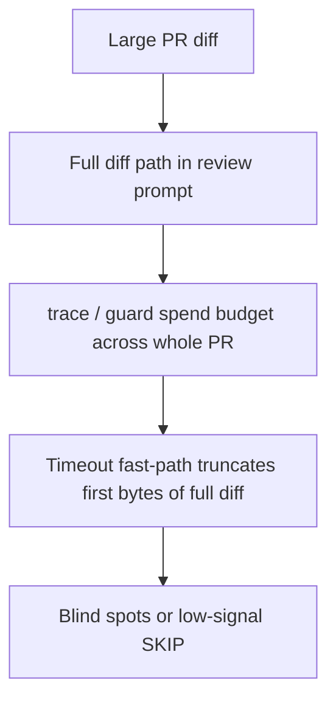
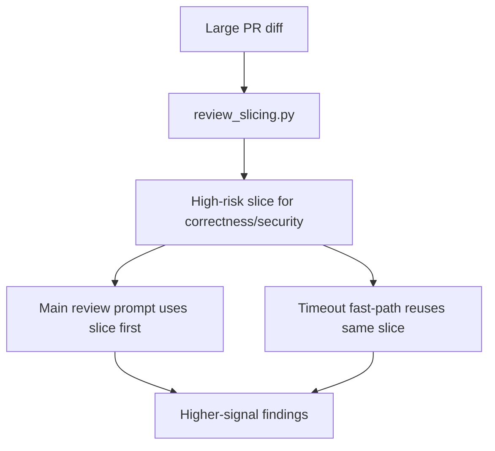
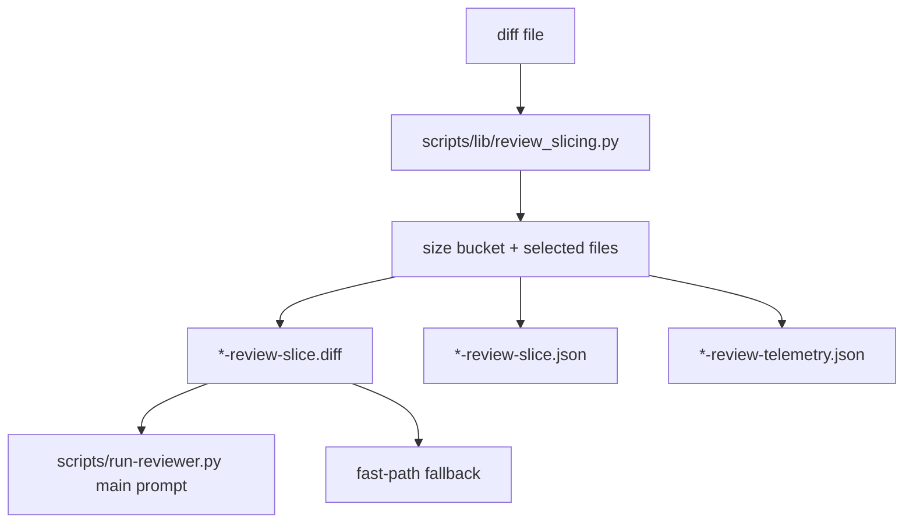

# Issue 334 Walkthrough: Large-PR High-Risk Review Slices

## Claim

Cerberus now gives `correctness` and `security` a bounded high-risk diff slice on large PRs before runtime execution, reuses that same slice during timeout salvage, and emits per-review telemetry keyed by perspective and PR-size bucket.

## What Changed

- Added `scripts/lib/review_slicing.py` to parse unified diff chunks, classify PR size, and build a bounded high-risk slice for `correctness` and `security`.
- Updated `scripts/run-reviewer.py` to:
  - switch the main review prompt to the prioritized slice on large PRs
  - persist slice metadata for inspection
  - reuse the prioritized slice during fast-path timeout fallback instead of truncating the full diff blindly
  - emit a `*-review-telemetry.json` artifact with perspective, size bucket, selected files, and timeout state
- Added `tests/test_review_slicing.py` to lock the slice planner, including a benchmark-derived `volume#401` replay-style case.
- Extended `tests/test_run_reviewer_runtime.py` to prove prompt switching, timeout fallback reuse, and timeout telemetry behavior.

## Before

- Large PRs still reached `correctness` and `security` as one coarse diff path.
- The main review prompt pointed at the full diff even when the issue was specifically about large-PR blind spots.
- Timeout salvage only kicked in after the main budget was gone, and its fast path used a raw byte truncation of the original diff.

## After

- Large PRs are bucketed before review execution.
- `correctness` and `security` get a prioritized slice diff first, so the main review budget is spent on the riskiest files rather than the whole PR surface.
- Timeout fast-path salvage now reuses that same slice, which makes partial output much more likely to carry signal instead of generic SKIP noise.
- Each run leaves behind a stable telemetry artifact that can be aggregated later by perspective and PR-size bucket.

## Evidence

- Targeted slice/runtime transcript: `docs/walkthroughs/issue-334-timeout-slice-targeted-tests.txt`
- Full repo gate transcript: `docs/walkthroughs/issue-334-timeout-slice-make-validate.txt`

## Persistent Verification

- `make validate`

## Before / After Shape

### Before

### After

### Architecture / State Change

## Why the new shape is better

- The large-PR mitigation now sits at review bootstrap, where it can change what the reviewer sees first, instead of only reacting after timeout.
- The same prioritized slice drives both the primary run and fallback salvage, so the lane stays coherent under pressure.
- The repo now has durable tests and telemetry artifacts for this behavior instead of relying on anecdotal timeout reports.

## Scope Notes

- No browser or frontend walkthrough was needed. This lane is internal runtime behavior, so the durable proof is the targeted runtime transcript plus the full repo validation gate.
