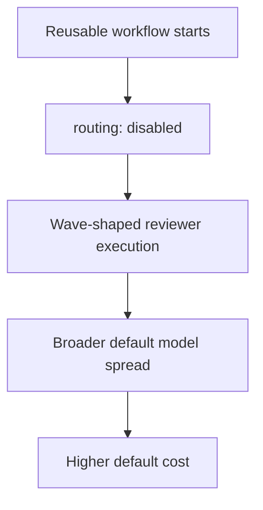
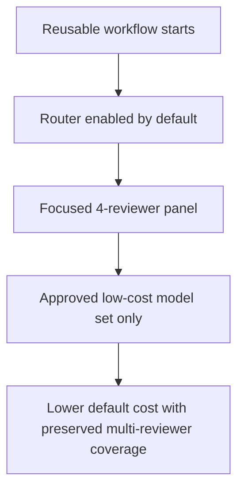
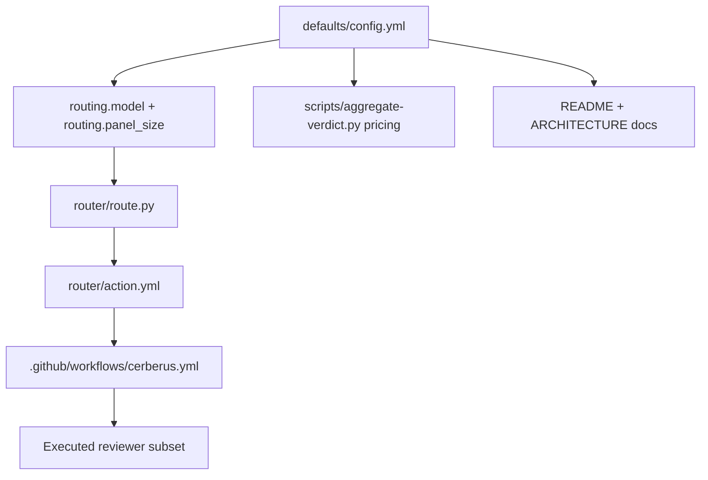

# Issue 344 Walkthrough: Emergency Cost-Control Defaults

## Reviewer Evidence

- Core claim: Cerberus now defaults to a routed, lower-cost reviewer panel built from the approved model set, and the reusable workflow no longer disables that router path.
- Primary artifact: this branch walkthrough plus `make validate` execution on `codex/issue-344-emergency-cost-control`.
- Persistent verification: `make validate`

## Walkthrough

### What was expensive before

- `defaults/config.yml` still exposed a broader, more expensive default reviewer mix than the emergency model allowlist.
- `.github/workflows/cerberus.yml` forced `routing: disabled`, so the main reusable workflow bypassed the focused router path and kept paying the wave-shaped execution cost.
- `router/route.py` still carried a fixed router model and a broader fallback panel that pulled in security even for doc/test-only changes.

### What changed on this branch

- Restricted default reviewer models to the approved low-cost set in `defaults/config.yml`.
- Enabled routing by default and reduced the default routed panel size to four reviewers.
- Let `router/action.yml` inherit panel size from config instead of hard-coding it in the action contract.
- Removed the workflow-level `routing: disabled` override so the reusable workflow actually uses the router path.
- Made the router model config-driven, tightened the routing prompt contract, and trimmed doc/test-only fallback panels to avoid unnecessary expensive reviewers.
- Updated verdict pricing and docs so cost reporting matches the new default model policy.

### What is true after

- Zero-config Cerberus installs now route into a smaller, cheaper default panel instead of forcing the broader wave path.
- The shipped defaults only use the approved models: `moonshotai/kimi-k2.5`, `minimax/minimax-m2.5`, `z-ai/glm-5`, `google/gemini-3-flash-preview`, `x-ai/grok-4.1-fast`, `x-ai/grok-4.20-multi-agent-beta`, `x-ai/grok-4.20-beta`, and `inception/mercury-2`.
- Router behavior, workflow behavior, docs, and pricing assumptions now tell the same story.

## Execution Proof

### Full repo gate

```text
$ make validate
1670 passed, 1 skipped in 52.64s
ruff clean
shellcheck clean
```

## Before / After Shape

### Before



### After



### Architecture / State Change



## Why the new shape is better

- The emergency cost-control posture is now enforced in the shipped defaults instead of depending on workflow overrides or operator memory.
- Routing is again the primary execution path in the reusable workflow, which makes the smaller panel and cheaper model mix actually matter.
- Docs and pricing now match runtime behavior, reducing the chance of future drift back toward a more expensive default lane.

## Residual Gap

- This branch does not remove the Cerberus Cloud GitHub App installation from Misty Step repositories. That remains an operational follow-up outside this repo because uninstalling or suspending the org-wide installation requires GitHub App admin access.
