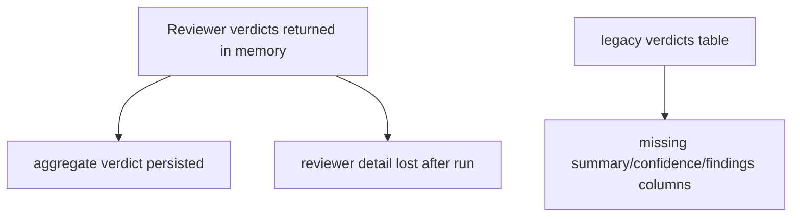
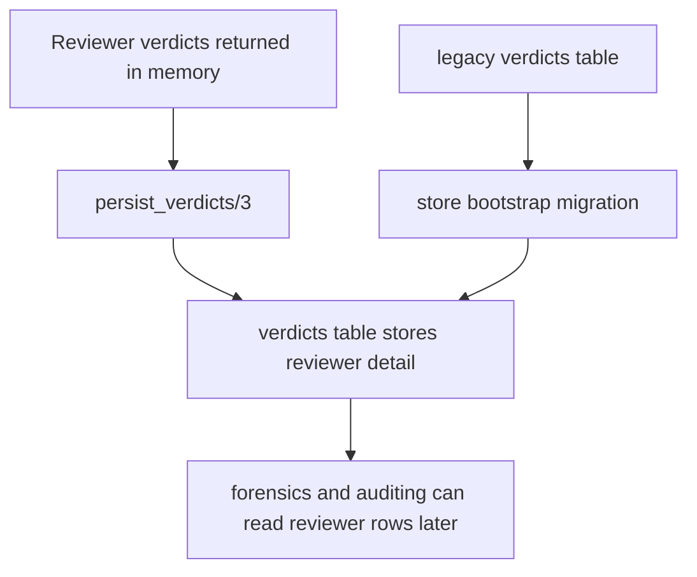

# Issue #418 Walkthrough: Persist Reviewer Verdicts

## Reviewer Evidence

- Core claim: the Elixir review pipeline now persists each reviewer verdict into the `verdicts` table, including summary, confidence, and findings, and it safely migrates legacy SQLite files that only had the old four-column verdict schema.
- Primary artifact: real branch execution through focused Elixir tests plus the full repo validation gate.
- Persistent verification:
  - `cd cerberus-elixir && mix test test/store_test.exs test/cerberus/store_review_run_test.exs test/cerberus/pipeline_test.exs`
  - `make validate`

## Walkthrough

### What was missing before

- The Elixir pipeline aggregated reviewer outputs but only persisted costs and the final aggregate review-run record.
- The `verdicts` table existed in the schema but only stored `review_run_id`, `reviewer`, and `verdict`, so reviewer-level forensics had nowhere to keep confidence, summary, or findings.
- Existing SQLite databases would not automatically pick up new columns because `CREATE TABLE IF NOT EXISTS` does not alter existing tables.

### What changed on this branch

- `Cerberus.Pipeline` now persists per-reviewer verdict artifacts before aggregation completes.
- `Cerberus.Store` now stores and reads reviewer `perspective`, `confidence`, `summary`, and `findings_json`.
- Store bootstrap now backfills missing verdict columns for legacy databases via targeted `ALTER TABLE` migrations.
- New tests cover the round trip, invalid finding filtering, pipeline persistence, and legacy-schema migration.

### What is true after

- Every completed review run leaves behind reviewer-level verdict records that can be inspected after success or failure.
- Existing databases upgrade safely the next time the store boots.
- Verdict persistence is no longer silent best-effort: if reviewer verdict writes fail, the pipeline fails instead of falsely reporting a clean completion.

## Execution Proof

### Focused Elixir verification

```text
$ cd cerberus-elixir && mix test test/store_test.exs test/cerberus/store_review_run_test.exs test/cerberus/pipeline_test.exs
27 tests, 0 failures
```

### Full repository gate

```text
$ make validate
1918 passed, 1 skipped in 121.52s
ruff clean
shellcheck clean
307 Elixir tests, 0 failures
```

## Before / After Shape

### Before



### After



## Why the new shape is better

- Reviewer-level evidence survives the pipeline instead of disappearing after aggregation.
- Legacy databases are upgraded mechanically at store boot, so the new write path is safe for existing installs.
- The pipeline now treats missing verdict persistence as a real failure, which is the right contract for audit data.

## Residual Gap

- `insert_verdict/2` still uses a map-based input shape. That keeps this lane small, but if verdict storage grows further it may be worth narrowing the API around a dedicated struct or validated constructor.
