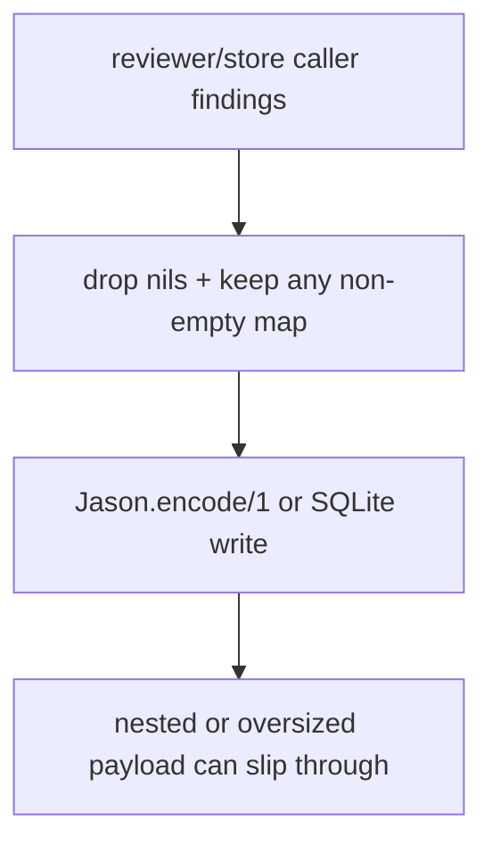
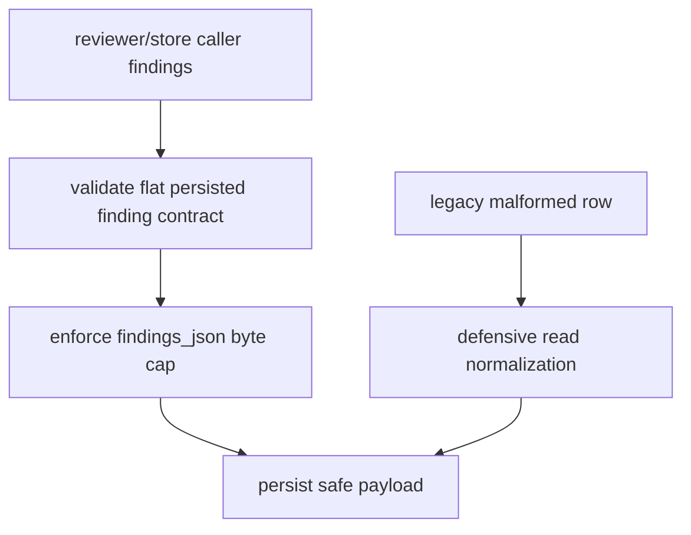

# Issue #437 Walkthrough: Harden Persisted Verdict Finding Payloads

## Reviewer Evidence

- Core claim: `Cerberus.Store` now enforces a persistence-safe findings contract on write and rejects oversized `findings_json` payloads before they reach SQLite.
- Primary artifact: focused Elixir persistence tests plus the full repository validation gate.
- Persistent verification:
  - `cd cerberus-elixir && mix test test/store_test.exs test/cerberus/store_review_run_test.exs test/cerberus/pipeline_test.exs`
  - `make validate`

## Walkthrough

### What was missing before

- The store normalized reviewer findings, but it accepted any non-empty map shape and only failed later if JSON encoding exploded.
- Nested maps and other non-scalar values could survive normalization and become persisted storage shape by accident.
- There was no byte cap on `findings_json`, so a very large reviewer payload could still be written into SQLite.

### What changed on this branch

- `Cerberus.Store` now validates persisted findings as flat JSON objects with stringable keys and scalar values.
- Write-time persistence rejects malformed findings with a precise `{:invalid_findings, ...}` error instead of silently dropping bad entries.
- `findings_json` now has an application-level byte limit (`65_536`) enforced before insert.
- The read path stays defensive: malformed legacy rows normalize down to safe findings instead of crashing review-run reads.
- Focused tests now cover malformed payload rejection, oversize rejection, exact boundary acceptance, and defensive read normalization.

### What is true after

- Direct store callers cannot persist nested or non-scalar finding payloads accidentally.
- Oversized reviewer findings fail at the store boundary before SQLite write time.
- Previously persisted malformed rows are still survivable on the read path.
- The pipeline path remains green because validated reviewer findings still serialize cleanly through the store.

## Execution Proof

### Focused Elixir verification

```text
$ cd cerberus-elixir && mix test test/store_test.exs test/cerberus/store_review_run_test.exs test/cerberus/pipeline_test.exs
39 tests, 0 failures
```

### Full repository gate

```text
$ make validate
✓ All validation checks passed
```

## Before / After Shape

### Before



### After



## Why the new shape is better

- Semantic reviewer validation stays where it belongs, in `Cerberus.Verdict`, while the store owns persistence safety.
- The store contract is strict without hardcoding the full current reviewer schema.
- Fail-fast write errors are better than silent data-shape drift inside an audit table.
