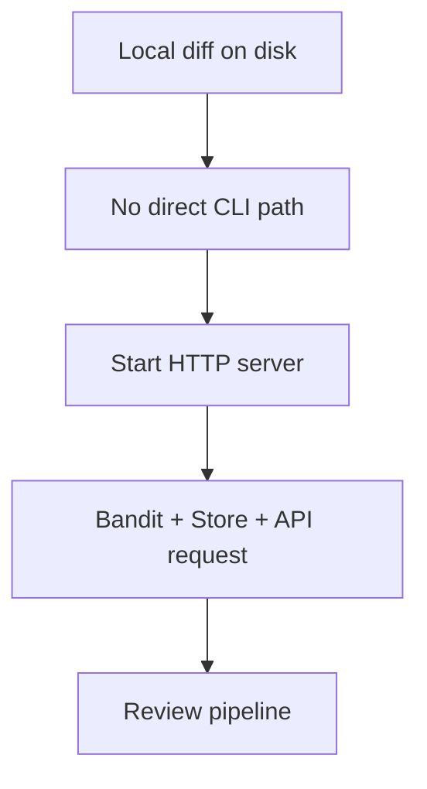
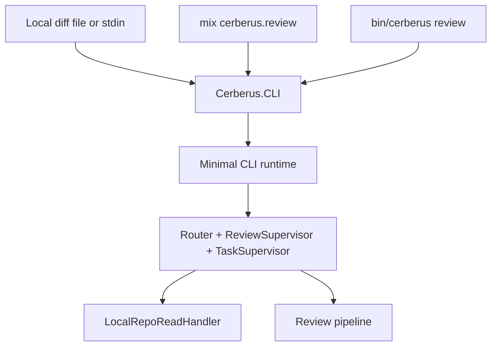

# Issue #443 Walkthrough: Local CLI Review Entrypoint

## Reviewer Evidence

- Core claim: Cerberus can now review a local unified diff through a shared CLI path from both `mix cerberus.review` and the built release, without starting the HTTP server.
- Primary artifact: terminal walkthrough with real branch execution evidence.
- Targeted transcript: `docs/walkthroughs/issue-443-cli-review-targeted.txt`
- Full validation transcript: `docs/walkthroughs/issue-443-cli-review-full-validation.txt`
- Persistent verification: `make validate`

## Walkthrough

### What was wrong before

- The Elixir engine only exposed review execution through the HTTP API.
- Local iteration required a running server, SQLite, and GitHub bootstrap context even when a developer already had a diff file in hand.
- Built releases had no non-interactive local review command, so there was no shared CLI lane to exercise engine behavior before shipping.

### What changed on this branch

- Added `Cerberus.CLI` as the shared local-review entrypoint for diff files and stdin.
- Added `mix cerberus.review` as the Mix-task surface for local review runs.
- Added a named `cerberus` release plus `rel/env.sh.eex` and `rel/overlays/bin/review` so `bin/cerberus review ...` reuses the same CLI path.
- Split application startup into `:server` and `:cli` child-spec modes so local review boots only the runtime pieces it needs.
- Added `Cerberus.Tools.LocalRepoReadHandler` so reviewer exploration tools read from the current working tree instead of GitHub.
- Added focused CLI, mix-task, and local repo tool tests, plus a `Makefile` shellcheck prune so release artifacts do not poison the repo gate.

### What is true after

- Developers can run a non-interactive local review from a diff file or stdin.
- Mix-task and release execution share the same CLI implementation instead of drifting.
- The local review path avoids starting Bandit or the store while still giving reviewers read-only repository exploration tools.
- The repo gate stays green even after building a release in `cerberus-elixir/_build`.

## Execution Proof

### Targeted CLI and release transcript

- `MIX_ENV=test mix cerberus.review --diff /tmp/issue-443.diff --format json`
- `cat /tmp/issue-443.diff | MIX_ENV=test mix cerberus.review --diff - --format json`
- `MIX_ENV=test mix release cerberus --overwrite`
- `MIX_ENV=test _build/test/rel/cerberus/bin/cerberus review --diff /tmp/issue-443.diff --format json`

Each command ran on this branch and the transcript shows the expected PASS-shaped JSON plus successful release assembly.

### Full repo gate

- `make validate`

The recorded run finished with `326 tests, 0 failures` for `cerberus-elixir` and `✓ All validation checks passed` for the full repository gate.

## Before / After Shape

### Before

### After

## Why the new shape is better

- Local review is now a first-class boundary instead of an API-only side effect.
- The release and Mix surfaces cannot drift easily because they share one implementation.
- Runtime startup is deeper and more explicit: server mode owns Bandit and the store, while CLI mode owns only the review-critical children.

## Residual Gap

- The walkthrough uses deterministic test-time LLM overrides for repeatable proof, so it proves the CLI/release path and output contract more than live-model variability. That is acceptable for this issue because the contract change is the entrypoint and runtime boundary, not reviewer semantics.
