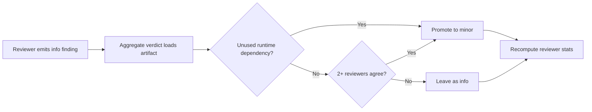

# Reviewer Evidence

## Title

Issue #300: promote meaningful unused-dependency findings from `info` to `minor`.

## Why Now

Cerberus was hiding actionable dependency hygiene findings when reviewers called out unused runtime packages like `lodash`. Those findings stayed at `info`, which meant they were easy to ignore and did not contribute to warning thresholds.

## Before

- Aggregation never promoted unused-dependency findings, even when the package was a known large runtime dependency.
- Cross-reviewer agreement on the same unused dependency produced duplicated `info` findings instead of a stronger signal.
- Reviewer stats stayed aligned with the original `info` severity, so downstream reporting understated the risk.

## What Changed

- `scripts/aggregate-verdict.py` now promotes unused runtime dependency findings to `minor` for a known set of non-trivial packages.
- The same aggregation pass promotes repeated unused-dependency findings when multiple reviewers agree on the same package/file pair and annotates the finding description with cross-reviewer agreement.
- Reviewer stats are recomputed after promotion so the artifact stays internally consistent.
- `.opencode/agents/maintainability.md` now tells `craft` to classify non-trivial unused runtime dependencies as `minor`.

## After

- Real runtime-cost dependency cleanup shows up as `minor` instead of being buried as `info`.
- Cross-reviewer agreement produces a stronger, explicit signal.
- Aggregated reviewer artifacts and their stats stay in sync after promotion.

## Verification

```bash
python3 -m pytest tests/test_aggregate_verdict.py -k 'promotes_large_unused_runtime_dependency_to_minor or keeps_large_known_package_as_info_when_dev_dependency or keeps_cross_reviewer_dev_dependencies_as_info or promotes_cross_reviewer_unused_dependency_and_marks_agreement or promoted_finding_renders_in_markdown or ignores_ambiguous_unused_dependency_titles_without_package_name' -v
python3 -m pytest tests/test_aggregate_verdict.py -v
python3 -m pytest tests/test_render_findings.py -v
python3 -m pytest tests/ --cov=scripts --cov-report=term-missing --cov-fail-under=70
```

## Residual Risk

- Promotion still relies on a narrow text contract from reviewer findings, so unknown phrasing or packages outside the curated set remain `info` until the upstream finding schema gets explicit dependency metadata.
- Reviewer verdict fields are intentionally unchanged, per the issue boundary, so only findings and stats are promoted in this lane.

## Merge Case

This branch fixes a real trust gap in Cerberus review output without widening the severity system. It strengthens the existing signal, preserves the downgrade boundaries, and adds regression coverage for the exact cases that were being lost.

## Diagrams




